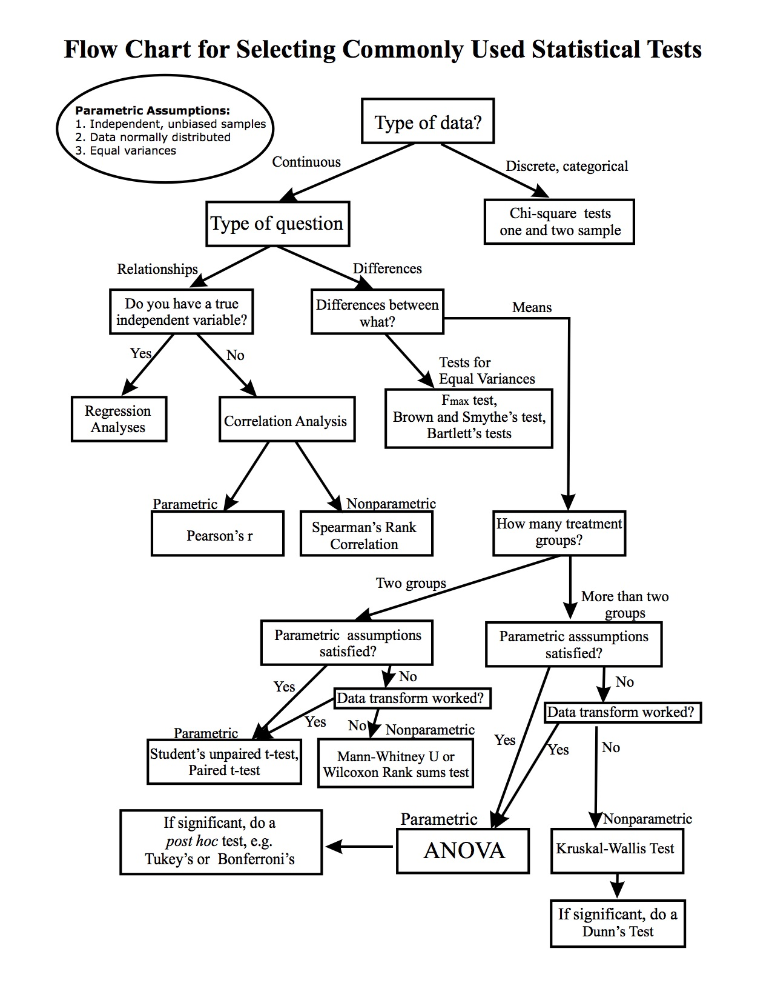

<br>

###Exploratory data analysis  


fundamental descriptive stats.  
distributions via density plots  
GLM. GLMM. Post hoc tests.  
modelR  

[slide deck for EDA](http://www.slideshare.net/cjlortie/exploratory-data-analysis-and-models-in-r)  

<b> Philosophy of R stats </b>    
Exploratory data analyses is everything we have done.
a. Tidy data.  
b. Inspect data structure.  
c. Data viz.  
d. Basic exploratory data analyses.  

However, now that we are ready to apply models, we add in one more tiny step. Visualize the data to better understand its typology and underlying distribution.  Then, you are ready to fit your models.  

A statistical model is an elegant, representative simplification of the patterns you have identified through data viz and EDA. It should capture data/experimental structure including the key variables, appropriate levels, and relevant covariation or contexts that mediate outcomes. It should support the data viz. It should provide an estimate of the statistical likelihood or probability of differences. Ideally, the underlying coefficients should also be mined to convey an estimate of effect sizes. A t.test, chi.square test, linear model, general linear model, or generalized linear mixed model are all examples of models that describe and summarize patterns and each have associated assumptions about the data they embody. Hence, the final step pre-model fit, is explore distributions.  

Conceptually, there are two kind of models. Those that look back and those that look forward. Think tardis or time machine. A model is always a snapshot using your time machine. It can be a grab of what happened or a future snap of what you predict. In R, there is simple code to time travel in either direction. Actually, there is no time - [Arrow of time](https://www.wired.com/2016/09/arrow-of-time/) - only an observer potential perception of it. Statistical models are our observers here. These observers use 'probability distributions' as we described in the first week sensu statistical thinking to calibrate what the think we observed or will observe given the evidence at hand.  

<b>Case study #1: x,y continuous</b>
```{r, case study 1, warning=FALSE, message=FALSE}
library(ggplot2)
library(dplyr)
library(modelr)
#Data viz for pattern
qplot(x,y, data = sim1)

#Now inspect distribution of y
ggplot(sim1) + 
  geom_density(mapping = aes(y))

ggplot(sim1) + 
  geom_histogram(mapping = aes(y), binwidth=5)

shapiro.test(sim1$y) #p-value <0.05 means is different from normal
qqnorm(sim1$y) #qqplots common to inspsect quantiles

#not significantly different from normal. great.
#model time!

#Remember, you own the purpose! Does x predict y? Linear model straight up!

m1 <-lm(y~x, data = sim1)
summary(m1)
#wow, these simulated are too good. Remember, this is the backwards, time travel, hypothesis test given what we have. Not prediction of new data per se but description of observation of patterns.
coef(m1) #remember 'minecraft' your model a bit to get a sense of effects.

```


<b> Case study #2 categorical x, continuous y</b>
```{r, case study study, warning=FALSE, message=FALSE}
ggplot(sim2) + 
  geom_point(aes(x, y)) #categorical x

ggplot(sim2) + 
  geom_density(mapping = aes(y))

ggplot(sim2) + 
  geom_histogram(mapping = aes(y), binwidth=1) #changing binwidth really changes perception of distribution

shapiro.test(sim2$y) 
qqnorm(sim2$y) #non-normal
#so, could do anova but likely not great link to underlying probability distribution
m2 <- aov(y~x, data = sim2)
summary(m2)
names(m2)
plot(m2$residuals) #residuals not bad
#library(fitdistrplus)

m3 <- glm(y~x, data = sim2, family = "quasi")
summary(m3) #better
#you can also explore distributions in even more detail to ensure correct model (correct = matches/describes underlying structure AND data distribution)
anova(m3, test="Chisq") #is x significant factor?

#Cullen and Frey Graphs are cool
#fitdistrplus not bad.  Usually, the type of data, ie. count, frequency, proportion is just as effective on deciding on family type vesus distribution exploration.  The goal is to fit the 'best' model. Best is simplest and representative. Formal tools to contrast models sometimes help too.

#note, mixed models, can use lme4 package if some effects and others are random. Need to think this over. Fixed = groups or levels in factors not due to random causes, random effects = likely from random causes or latent drivers such as population/species specificity.

```

<b> Case study #3: interactions cat.x, cont.x, y</b>
```{r, interactions with different x.classes, warning=FALSE, message=FALSE}
str(sim3)
ggplot(sim3) +
  geom_point(aes(x1, y, colour = x2))
#x1 is continous
#x2 is categorical
#Q are there an effect of xs on y and do the effect interact, i.e. level of x1 influence changes by x2.

ggplot(sim3) + 
  geom_density(mapping = aes(y))

ggplot(sim3) + 
  geom_histogram(mapping = aes(y), binwidth=1)

shapiro.test(sim3$y) 
qqnorm(sim3$y)  
#s.d. from normal but not bad. could be contigent on the levels of x.

ggplot(sim3, aes(x1, y)) + 
  geom_boxplot(aes(colour = x2))
#so, looks like the distribution of y relates to the factors. Likely good to go on parametric linear model.

m4 <-lm(y~x1*x2, data = sim3) #interactions terms for all levels
summary(m4)
m5 <-lm(y~x1+x2, data = sim3) #independent x1 & x2 effects on 7 modeled.
summary(m5)
plot(m5) #sometimes I plot the model to explore/mine model for its capacity to describe the patterns
anova(m5, test="Chisq") #tells you if effects are significant.

#you can also contrast different models using the anova of different models.
m.b <-anova(m4,m5, test="Chisq")
m.b

```

<b> Case study #4: interactions cont.x, cont.x, y</b>
```{r, interactions with same x.classes, warning=FALSE, message=FALSE}
str(sim4)
ggplot(sim4) +
  geom_point(aes(x1, y, colour = x2))

ggplot(sim4) + 
  geom_density(mapping = aes(y))

ggplot(sim4) + 
  geom_histogram(mapping = aes(y), binwidth=1)

shapiro.test(sim4$y) #more divegence from normality
qqnorm(sim4$y)  
m6 <-glm(y~x1*x2, data = sim4)
summary(m6) #significant interaction term in model
anova(m6, test="Chisq") #Looks solid.

m7 <-glm(y~x1+x2, data = sim4)
summary(m7) #missed interaction term here and given distribution exploration, likely important.

m.b2 <-anova(m6, m7, test="Chisq")
m.b2

```

<b> Case study #5: real data diamonds</b>
```{r, diamonds you never fail use, warning=FALSE, message=FALSE}
#Lucy.
#See data viz week for first steps.
#real data always more complex
ggplot(diamonds) +
  geom_point(aes(carat, price, colour = cut))
#so price is the most likely response we want to know about!
#two key factors, different x.classes, cut is categorical, and carat is continous
#look at price distribution (likely need to do by each x)
ggplot(diamonds) +
  geom_freqpoly(aes(price)) #long tail

#now do by the two xs to see how y varies
ggplot(diamonds, aes(carat, colour = cut)) +
         geom_freqpoly(binwidth = 0.1)

set.seed(1000)
dsmall<-diamonds[sample(nrow(diamonds), 1000), ]
shapiro.test(dsmall$price) 
qqnorm(dsmall$price)  
#ok, so we have a handle on the distribution.
#certainly non-normal.

#last idea!
#before we move to fitting a model recognizing that the data look like negative binomial or poisson given the class, what if there are a relationship between the the xs?
#what if larger diamonds cost more and better cut diamonds costs more but there are not more better cut AND large diamonds out there? Covariation is not positive.

#EDA on just that
ggplot(diamonds, aes(cut, carat)) +
  geom_boxplot()
m8 <-glm(carat~cut, data=diamonds)
summary(m8) #looks different! More poor cut diamonds are larger...
library(lsmeans)
lsmeans(m8, "cut", adjust="tukey") # to see ls means

#ok now ready for a simple model.
library(MASS)
m9 <-glm.nb(price~carat*cut, data = diamonds)
summary(m9)
anova(m9, test="Chisq")

```
<b>Tips</b>  
lme4 for mixed models  
vegan for ordinations  
Lavaan for SEMs  
MASS for count and negative binomial data  
(1 | factor) treats as random factor  

Ensure you see the different applications of the following models:  
anova  
lm  
glm  
glmm  

[EDA from a data science perspective: predictive](http://r4ds.had.co.nz/exploratory-data-analysis.html#introduction-3)  

<b> Practical skill outcomes of R stats useful for competency test</b>  
Worflow description complete now.  

Be able to use EDA & data viz to select a model.  
Be able to explore distributions of datasets.  
Be able to fit descriptive models (super simple to simple).  
Predictive models if you like too but not required.  
Be able to examine efficiacy of a model.  

Recognize through application of a few models that the following rule is never broken in stats...  

Rule: Statistics are never prescriptive.   
 
Processes include description or prediction.  
Models are powerful, purposeful tools you can use to capture & communicate evidence.

<b>Homework</b>  
Revisit survey, ttc, or footprints data and end with a model.

<b> Readings </b>  

Text CH9 & 10  

[GLMM for ecologists](http://glmm.wikidot.com)

[A practical guide to linear models](http://avesbiodiv.mncn.csic.es/estadistica/curso2011/regm26.pdf)

[General how to choose the right test](http://med.cmb.ac.lk/SMJ/VOLUME%203%20DOWNLOADS/Page%2033-37%20-%20Choosing%20the%20correct%20statistical%20test%20made%20easy.pdf)

[SUPER flowchart](http://abacus.bates.edu/~ganderso/biology/resources/stats_flow_chart_v2014.pdf)

[Interpreting R output](https://rstudio-pubs-static.s3.amazonaws.com/119859_a290e183ff2f46b2858db66c3bc9ed3a.html)

  


